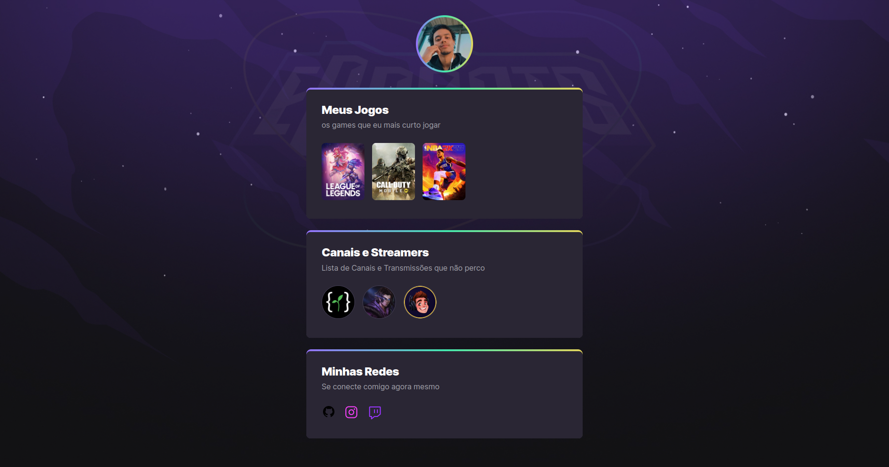

# NLW eSports

Projeto construido no evento Next Level Week da Rocketseat

A ideia por trás do projeto é muntar uma página para agrupar seus interesses no segmento de **eSports**, sendo a página dividida em jogos que goste, canais e streamers que acompanha e suas redes sociais.

[:link: Clique aqui para visitar](https://juliosoaresl.github.io/nlw/)

## :computer: Tecnologias

- HTML
- CSS
- git e GitHub

## Aprendizado

Com esse projeto compreendi principalmente como utilizar animações com o *CSS* e como melhorar o emcapsulamento do *HTML*, bem como a visualização do *CSS*

## :phone: Contato

- :email: juliosoareslima@outlook.com